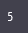
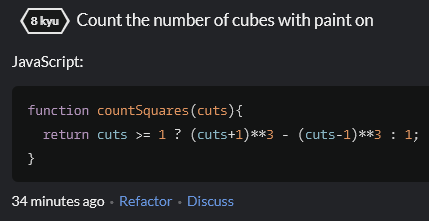

# WEB-LAB-5
 
<p align = "center">МИНИСТЕРСТВО НАУКИ И ВЫСШЕГО ОБРАЗОВАНИЯ<br>
РОССИЙСКОЙ ФЕДЕРАЦИИ<br>
ФЕДЕРАЛЬНОЕ ГОСУДАРСТВЕННОЕ БЮДЖЕТНОЕ<br>
ОБРАЗОВАТЕЛЬНОЕ УЧРЕЖДЕНИЕ ВЫСШЕГО ОБРАЗОВАНИЯ<br>
«САХАЛИНСКИЙ ГОСУДАРСТВЕННЫЙ УНИВЕРСИТЕТ»</p>
<br><br><br><br><br><br>
<p align = "center">Институт естественных наук и техносферной безопасности<br>Кафедра информатики<br>Шинкаренко Кирилл Константинович</p>
<br><br><br>
<p align = "center"><br><strong>Лабораторная работа №5.«JS»</strong><br>01.03.02 Прикладная математика и информатика</p>
<br><br><br><br><br><br><br><br><br><br><br><br>
<p align = "right">Научный руководитель<br>
Соболев Евгений Игоревич</p>
<br><br><br>
<p align = "center">г. Южно-Сахалинск<br>2024 г.</p>
<br><br><br><br><br><br><br><br><br><br><br><br>

<h1 align = "center">Введение</h1>

<p><b>HTML</b> —  стандартизированный язык гипертекстовой разметки документов для просмотра веб-страниц в браузере. Веб-браузеры получают HTML документ от сервера по протоколам HTTP/HTTPS или открывают с локального диска, далее интерпретируют код в интерфейс, который будет отображаться на экране монитора.</p>
<p><b>CSS</b> — формальный язык описания внешнего вида документа, написанного с использованием языка разметки. Также может применяться к любым XML-документам, например, к SVG или XUL.</p>


<h1 style="text-align: center">Задачи CSS</h1>
<ol>
    <li>Создайте переменную str и присвойте ей значение 'hdfgv'. Обращаясь к отдельным символам этой строки выведите на
        экран символ 'h', символ 'd', символ 'v'.
    </li>
    <li>Напишите скрипт, который считает количество секунд в часе.</li>
    <li>Переделайте приведенный код так, чтобы в нем использовались операции +=, -=, *=, /=, ++, --. Количество строк
        кода при этом не должно измениться. Код для переделки: <br> <code>var num = 1; <br> num = num + 12; <br> num =
            num - 14; <br> num = num * 5; <br> num = num / 7; <br> num = num + 1; <br> num = num - 1; <br>
            alert(num);</code>
    </li>
    <li>Создайте переменную num и присвойте ей значение 3. Выведите значение этой переменной на экран с помощью метода
        alert.
    </li>
    <li>Создайте переменные a=10 и b=2. Выведите на экран их сумму, разность, произведение и частное (результат
        деления).
    </li>
    <li>Создайте переменные c=15 и d=2. Просуммируйте их, а результат присвойте переменной result. Выведите на экран
        значение переменной result.
    </li>
    <li>Создайте переменные a=10, b=2 и c=5. Выведите на экран их сумму.</li>
    <li>Создайте переменные a=17 и b=10. Отнимите от a переменную b и результат присвойте переменной c. Затем создайте
        переменную d, присвойте ей значение 7. Сложите переменные c и d, а результат запишите в переменную result.
        Выведите на экран значение переменной result.
    </li>
    <li>Напишите скрипт, который считает количество секунд в часе, в сутках, в месяце.</li>
    <li>Создайте три переменные - час, минута, секунда. С их помощью выведите текущее время в формате
        'час:минута:секунда'.
    </li>
    <li>Создайте переменную, присвойте ей число. Возведите это число в квадрат. Выведите его на экран.</li>
    <li>Напишите однострочное решение, которое вычисляет сумму квадратных корней для всех чётных чисел целочисленного
        массива.
    </li>
    <li>Яблоко стоит 1.15, апельсин стоит 2.30. Сколько они стоят вместе – чему равна сумма 1.15 + 2.30 с точки зрения
        JavaScript?
    </li>
    <li>Какое будет выведено значение: <code>let x = 5; alert(x++);</code> ?</li>
    <li>Чему равно такое выражение: <code>[] + false - null + true</code> ?</li>
    <li>Что выведет этот код: <code>let y = 1; let x = y = 2; console.log(x);</code> ?</li>
    <li>Чему равна сумма <code>[] + 1 + 2</code> ?</li>
    <li>Создайте переменные <code>a6, a7, a8, a9, a10</code>. Поместите в них результат выражений: <br> <code>5
        % 3,</code> <br> <code>3 % 5,</code> <br> <code>5 + '3',</code> <br> <code>'5' - 3,</code> <br> <code>75
        + 'кг'</code>
    </li>
    <li>Напишите скрипт, который находит площадь прямоугольника высота 23см (в числовую переменную height), шириной 10см
        (в числовую переменную width), значение площади должно храниться в числовой переменной s.
    </li>
    <li>Напишите скрипт, который находит объем цилиндра высотой 10м (переменная heightC) и диаметром основания 4м (dC),
        результат поместите в переменную v.
    </li>
    <li>Даны размер ипотечного кредита (S — 2 млн.руб), процентная ставка (p — 10%), кол-во лет (years — 5). Найти
        переплату по кредиту, значение переплаты должно содержаться в переменной perepl.
    </li>
    <li>Определите переменные str, num, flag и txt со значениями «Привет», 123, true, «true». При помощи оператора
        определения типа убедитесь, что переменные принадлежат типам: string, number, boolean.
    </li>
    <li>Дано число, необходимо вернуть противоположное число.</li>
    <li>Решить задачу на сайте https://www.codewars.com/kata/56530b444e831334c0000020 </li>
    <li>Решить задачу на сайте https://www.codewars.com/kata/583710ccaa6717322c000105</li>
    <li>Решить задачу на сайте https://www.codewars.com/kata/5a805d8cafa10f8b930005ba</li>
    <li>Решить задачу на сайте https://www.codewars.com/kata/5763bb0af716cad8fb000580</li>
    <li>Решить задачу на сайте https://www.codewars.com/kata/578a8a01e9fd1549e50001f1</li>
    <li>Решить задачу на сайте https://www.codewars.com/kata/57eae20f5500ad98e50002c5</li>
</ol>


<h1 style="text-align: center">Решения JS</h1>

<h2 style="text-align: center">Файлы 1.html - 23.html</h2>

1
```html
<!DOCTYPE html>
<html lang="en">
<head>
    <meta charset="UTF-8">
    <meta name="viewport" content="width=device-width, initial-scale=1.0">
    <title>Document</title>
</head>
<body>
    <script>
        let str = "hdfgv";
        console.log(str[0], str[1], str[str.length-1]);
    </script>
</body>
</html>
```

2
```html
<!DOCTYPE html>
<html lang="en">
<head>
    <meta charset="UTF-8">
    <meta name="viewport" content="width=device-width, initial-scale=1.0">
    <title>Document</title>
</head>
<body>
    <script>
        let hours = 1;

        function countSecondsInHours(hours) {
            return hours * 3600;
        }

        console.log(countSecondsInHours(hours));
    </script>
</body>
</html>
```

3
```html
<!DOCTYPE html>
<html lang="en">
  <head>
    <meta charset="UTF-8" />
    <meta name="viewport" content="width=device-width, initial-scale=1.0" />
    <title>Document</title>
  </head>
  <body>
    <script>
      var num = 1;
      num += 12;
      num -= 14;
      num *= 5;
      num /= 7;
      num++;
      num--;
      alert(num);

      var num1 = 1;
      num1 = num1 + 12;
      num1 = num1 - 14;
      num1 = num1 * 5;
      num1 = num1 / 7;
      num1 = num1 + 1;
      num1 = num1 - 1;
      alert(num1);
    </script>
  </body>
</html>

```

4
```html
<!DOCTYPE html>
<html lang="en">
<head>
    <meta charset="UTF-8">
    <meta name="viewport" content="width=device-width, initial-scale=1.0">
    <title>Document</title>
</head>
<body>
    <script>
        let num = 3;
        alert(num);
    </script>
</body>
</html>
```

5
```html
<!DOCTYPE html>
<html lang="en">
<head>
    <meta charset="UTF-8">
    <meta name="viewport" content="width=device-width, initial-scale=1.0">
    <title>Document</title>
</head>
<body>
    <script>
        let a = 10, b = 2;

        alert(
            (a + b) + '\n' +
            (a - b) + '\n' +
            (a * b) + '\n' +
            (a / b)
        );
    </script>
</body>
</html>
```

6
```html
<!DOCTYPE html>
<html lang="en">
<head>
    <meta charset="UTF-8">
    <meta name="viewport" content="width=device-width, initial-scale=1.0">
    <title>Document</title>
</head>
<body>
    <script>
        let c = 15, d = 2;

        let result = c + d;

        alert(result);
    </script>
</body>
</html>
```

7
```html
<!DOCTYPE html>
<html lang="en">
<head>
    <meta charset="UTF-8">
    <meta name="viewport" content="width=device-width, initial-scale=1.0">
    <title>Document</title>
</head>
<body>
    <script>
        let a = 10, b = 2, c = 5;

        alert(a + b + c);
    </script>
</body>
</html>
```

8
```html
<!DOCTYPE html>
<html lang="en">
<head>
    <meta charset="UTF-8">
    <meta name="viewport" content="width=device-width, initial-scale=1.0">
    <title>Document</title>
</head>
<body>
    <script>
        let a = 17, b = 10;

        let c = a - b;

        let d = 7;

        let result = c + d;

        alert(result);
    </script>
</body>
</html>
```

9
```html
<!DOCTYPE html>
<html lang="en">
<head>
    <meta charset="UTF-8">
    <meta name="viewport" content="width=device-width, initial-scale=1.0">
    <title>Document</title>
</head>
<body>
    <script>
        let daysInMonth = 30; //Будем считать, что в месяце 30 дней
        let hoursInDay = 24;

        function secondsInHours(hours){
            return hours * 60 * 60;
        }

        function secondsInDays(days) {
            return secondsInHours(hoursInDay) * days;
        }

        function secondsInMonths(months) {
            return secondsInDays(daysInMonth) * months; 
        }

        console.log(secondsInHours(1));
        console.log(secondsInDays(1));
        console.log(secondsInMonths(1));
    </script>
</body>
</html>
```

10
```html
<!DOCTYPE html>
<html lang="en">
<head>
    <meta charset="UTF-8">
    <meta name="viewport" content="width=device-width, initial-scale=1.0">
    <title>Document</title>
</head>
<body>
    <script>
        let date = new Date();

        let currentHours = date.getHours();
        let currentMinutes = date.getMinutes();
        let currentSeconds = date.getSeconds();

        console.log(`${currentHours}:${currentMinutes}:${currentSeconds}`);
    </script>
</body>
</html>
```

11
```html
<!DOCTYPE html>
<html lang="en">
<head>
    <meta charset="UTF-8">
    <meta name="viewport" content="width=device-width, initial-scale=1.0">
    <title>Document</title>
</head>
<body>
    <script>
        let x = 11;

        console.log(Math.pow(x, 2));
    </script>
</body>
</html>
```

12
```html
<!DOCTYPE html>
<html lang="en">
<head>
    <meta charset="UTF-8">
    <meta name="viewport" content="width=device-width, initial-scale=1.0">
    <title>Document</title>
</head>
<body>
    <script>
        let arr = [12, 15, 11, 6, 10, 22, 101, 253];

        function sumOfSquaredEvenItems(array) {
            return array.map(item => item % 2 == 0? item : 0).reduce((sum, curItem) => sum + Math.pow(curItem, 2), 0);
        }

        alert(sumOfSquaredEvenItems(arr));
    </script>
</body>
</html>
```

13
```html
<!DOCTYPE html>
<html lang="en">
<head>
    <meta charset="UTF-8">
    <meta name="viewport" content="width=device-width, initial-scale=1.0">
    <title>Document</title>
</head>
<body>
    <script>
        let applePrice = 1.15;
        let orangePrice = 2.30;

        console.log(
            (applePrice + orangePrice) + '\n' +
            (applePrice + orangePrice).toFixed(2)
    );

    </script>
</body>
</html>
```

14
```html
<!DOCTYPE html>
<html lang="en">
<head>
    <meta charset="UTF-8">
    <meta name="viewport" content="width=device-width, initial-scale=1.0">
    <title>Document</title>
</head>
<body>
    <script>
        let x = 5;
        alert(x++);
    </script>
</body>
</html>
```

15
```html
<!DOCTYPE html>
<html lang="en">
<head>
    <meta charset="UTF-8">
    <meta name="viewport" content="width=device-width, initial-scale=1.0">
    <title>Document</title>
</head>
<body>
    <script>
        let res = [] + false - null + true;
        console.log(res);

        /* 
        [] - true
        null, undefined - false
        0, -0, NaN - false
        "" - false
        */
    </script>
</body>
</html>
```

16
```html
<!DOCTYPE html>
<html lang="en">
<head>
    <meta charset="UTF-8">
    <meta name="viewport" content="width=device-width, initial-scale=1.0">
    <title>Document</title>
</head>
<body>
    <script>
        let y = 1, x = y = 2;
        console.log(x);
    </script>
</body>
</html>
```

17
```html
<!DOCTYPE html>
<html lang="en">
<head>
    <meta charset="UTF-8">
    <meta name="viewport" content="width=device-width, initial-scale=1.0">
    <title>Document</title>
</head>
<body>
    <script>
        console.log([] + 1 + 2); //[] считается пустой строкой (массивом символов)
    </script>
</body>
</html>
```

18
```html
<!DOCTYPE html>
<html lang="en">
<head>
    <meta charset="UTF-8">
    <meta name="viewport" content="width=device-width, initial-scale=1.0">
    <title>Document</title>
</head>
<body>
    <script>
        let a6 = 5 % 3,
            a7 = 3 % 5,
            a8 = 5 + '3',
            a9 = '5' - 3, // сработало приведение типов
            a10 = 75 + ' кг';

        console.log(
            a6 + '\n' +
            a7 + '\n' +
            a8 + '\n' +
            a9 + '\n' +
            a10 + '\n'
        );
    </script>
</body>
</html>
```

19
```html
<!DOCTYPE html>
<html lang="en">
<head>
    <meta charset="UTF-8">
    <meta name="viewport" content="width=device-width, initial-scale=1.0">
    <title>Document</title>
</head>
<body>
    <script>
        function squareArea(width, height) {
            return width * height;
        }

        let s = squareArea(10, 23);

        console.log(`Площадь равна ${s} квадратных единиц`);
    </script>
</body>
</html>
```

20
```html
<!DOCTYPE html>
<html lang="en">
<head>
    <meta charset="UTF-8">
    <meta name="viewport" content="width=device-width, initial-scale=1.0">
    <title>Document</title>
</head>
<body>
    <script>
        function cylinderVolume(height, diameter) {
            let radius = diameter / 2;
            return Math.PI * Math.pow(radius, 2) * height;
        }

        let v = cylinderVolume(10, 4);

        console.log(`Объём цилиндра равен ${v.toFixed(2)} кубических единиц.`);
    </script>
</body>
</html>
```

21
```html
<!DOCTYPE html>
<html lang="en">
<head>
    <meta charset="UTF-8">
    <meta name="viewport" content="width=device-width, initial-scale=1.0">
    <title>Document</title>
</head>
<body>
    <script>
        function countMonthPayment(amount, percent, years) {
            let monthPercent = (percent/12)/100;
            let months = years * 12;
            return amount * ((monthPercent * Math.pow(1+monthPercent, months))/(Math.pow(1+monthPercent, months)-1));
        }

        function countOverpayment(amount, percent, years) {
            let months = years * 12;
            return countMonthPayment(amount, percent, years) * months - amount;
        }

        let overpayment = countOverpayment(2000000, 10, 5);

        console.log(overpayment);
    </script>
</body>
</html>
```

22
```html
<!DOCTYPE html>
<html lang="en">
<head>
    <meta charset="UTF-8">
    <meta name="viewport" content="width=device-width, initial-scale=1.0">
    <title>Document</title>
</head>
<body>
    <script>
        let str = "Hello!",
            num = 123,
            flag = true,
            txt = "true";

        console.log(
            typeof(str) + '\n' +
            typeof(num) + '\n' +
            typeof(flag) + '\n' +
            typeof(txt)
        );
    </script>
</body>
</html>
```

23
```html
<!DOCTYPE html>
<html lang="en">
<head>
    <meta charset="UTF-8">
    <meta name="viewport" content="width=device-width, initial-scale=1.0">
    <title>Document</title>
</head>
<body>
    <script>
        let findOppositeNumber = (number) => -number;

        console.log(typeof(findOppositeNumber))
        
        console.log(findOppositeNumber(-5));
    </script>
</body>
</html>
```

<h2 style="text-align: center">CodeWars 1-6 задача</h2>

1
```javascript
function chromosomeCheck(sperm) {
  return sperm.includes("Y")? "Congratulations! You're going to have a son." : "Congratulations! You're going to have a daughter.";
}
```

2
```javascript
function simpleMultiplication(number) {
    return number % 2 == 0? number * 8 : number * 9;
}
```

3
```javascript
function nearestSq(n){
    return Number.isInteger(Math.sqrt(n)) ? n : Math.round(Math.sqrt(n))**2;
}
```

4
```javascript
function countSquares(cuts){
  return cuts >= 1 ? (cuts+1)**3 - (cuts-1)**3 : 1;
}
```

5
```javascript
function periodIsLate(last, today, cycleLength) {
  return Math.abs(last - today)/(24 * 60 * 60 * 1000) > cycleLength;
}
```

6
```javascript
function noSpace(x){
  return x.replaceAll(' ', '');
}
```


<h1 align = "center">Результат HTML</h1>

<ol>
  <li>
    <div style="display: flex; flex-direction: column">
        <div>Создайте переменную str и присвойте ей значение 'hdfgv'. Обращаясь к отдельным символам этой строки выведите на
    экран символ 'h', символ 'd', символ 'v'.</div>
        
    </div>
  </li>
  <li>
    <div style="display: flex; flex-direction: column">
        <div>Напишите скрипт, который считает количество секунд в часе.</div>
        
    </div>
  </li>
  <li>
    <div style="display: flex; flex-direction: column">
        <div>Переделайте приведенный код так, чтобы в нем использовались операции +=, -=, *=, /=, ++, --. Количество строк
    кода при этом не должно измениться. Код для переделки: <br> <code>var num = 1; <br> num = num + 12; <br> num =
        num - 14; <br> num = num * 5; <br> num = num / 7; <br> num = num + 1; <br> num = num - 1; <br>
        alert(num);</code></div>
        
    </div>
  </li>
  <li>
    <div style="display: flex; flex-direction: column">
        <div>Создайте переменную num и присвойте ей значение 3. Выведите значение этой переменной на экран с помощью метода
    alert.</div>
        
    </div>
  </li>
  <li>
    <div style="display: flex; flex-direction: column">
        <div>Создайте переменные a=10 и b=2. Выведите на экран их сумму, разность, произведение и частное (результат
    деления).</div>
        
    </div>
  </li>
  <li>
    <div style="display: flex; flex-direction: column">
        <div>Создайте переменные c=15 и d=2. Просуммируйте их, а результат присвойте переменной result. Выведите на экран
    значение переменной result.</div>
        
    </div>
  </li>
  <li>
    <div style="display: flex; flex-direction: column">
        <div>Создайте переменные a=10, b=2 и c=5. Выведите на экран их сумму.</div>
        
    </div>
  </li>
  <li>
    <div style="display: flex; flex-direction: column">
        <div> Создайте переменные a=17 и b=10. Отнимите от a переменную b и результат присвойте переменной c. Затем создайте
    переменную d, присвойте ей значение 7. Сложите переменные c и d, а результат запишите в переменную result.
    Выведите на экран значение переменной result.</div>
        
    </div>
  </li>
  <li>
    <div style="display: flex; flex-direction: column">
        <div>Напишите скрипт, который считает количество секунд в часе, в сутках, в месяце.</div>
        
    </div>
  </li>
  <li>
    <div style="display: flex; flex-direction: column">
        <div>Создайте три переменные - час, минута, секунда. С их помощью выведите текущее время в формате
    'час:минута:секунда'.</div>
        
    </div>
  </li>
  <li>
    <div style="display: flex; flex-direction: column">
        <div>Создайте переменную, присвойте ей число. Возведите это число в квадрат. Выведите его на экран.</div>
        
    </div>
  </li>
  <li>
    <div style="display: flex; flex-direction: column">
        <div>Напишите однострочное решение, которое вычисляет сумму квадратных корней для всех чётных чисел целочисленного
    массива.</div>
        
    </div>
  </li>
  <li>
    <div style="display: flex; flex-direction: column">
        <div>Яблоко стоит 1.15, апельсин стоит 2.30. Сколько они стоят вместе – чему равна сумма 1.15 + 2.30 с точки зрения
    JavaScript?</div>
        
    </div>
  </li>
  <li>
    <div style="display: flex; flex-direction: column">
        <div>Какое будет выведено значение: <code>let x = 5; alert(x++);</code> ?</div>
        
    </div>
  </li>
  <li>
    <div style="display: flex; flex-direction: column">
        <div>Чему равно такое выражение: <code>[] + false - null + true</code> ?</div>
        
    </div>
  </li>
  <li>
    <div style="display: flex; flex-direction: column">
        <div>Что выведет этот код: <code>let y = 1; let x = y = 2; console.log(x);</code> ?</div>
        
    </div>
  </li>
  <li>
    <div style="display: flex; flex-direction: column">
        <div>Чему равна сумма <code>[] + 1 + 2</code> ?</div>
        
    </div>
  </li>
  <li>
    <div style="display: flex; flex-direction: column">
        <div>Создайте переменные <code>a6, a7, a8, a9, a10</code>. Поместите в них результат выражений: <br> <code>5
    % 3,</code> <br> <code>3 % 5,</code> <br> <code>5 + '3',</code> <br> <code>'5' - 3,</code> <br> <code>75
    + 'кг'</code></div>
        
    </div>
  </li>
  <li>
    <div style="display: flex; flex-direction: column">
        <div>Напишите скрипт, который находит площадь прямоугольника высота 23см (в числовую переменную height), шириной 10см
    (в числовую переменную width), значение площади должно храниться в числовой переменной s.</div>
        
    </div>
  </li>
  <li>
    <div style="display: flex; flex-direction: column">
        <div>Напишите скрипт, который находит объем цилиндра высотой 10м (переменная heightC) и диаметром основания 4м (dC),
    результат поместите в переменную v.</div>
        
    </div>
  </li>
  <li>
    <div style="display: flex; flex-direction: column">
        <div>Даны размер ипотечного кредита (S — 2 млн.руб), процентная ставка (p — 10%), кол-во лет (years — 5). Найти
    переплату по кредиту, значение переплаты должно содержаться в переменной perepl.</div>
        
    </div>
  </li>
  <li>
    <div style="display: flex; flex-direction: column">
        <div> Определите переменные str, num, flag и txt со значениями «Привет», 123, true, «true». При помощи оператора
    определения типа убедитесь, что переменные принадлежат типам: string, number, boolean.</div>
        
    </div>
  </li>
  <li>
    <div style="display: flex; flex-direction: column">
        <div>Дано число, необходимо вернуть противоположное число.</div>
        
    </div>
  </li>
  <li>
    <div style="display: flex; flex-direction: column">
        <div>Решить задачу на сайте https://www.codewars.com/kata/56530b444e831334c0000020 </div>
        
    </div>
  </li>
  <li>
    <div style="display: flex; flex-direction: column">
        <div>Решить задачу на сайте https://www.codewars.com/kata/583710ccaa6717322c000105</div>
        
    </div>
  </li>
  <li>
    <div style="display: flex; flex-direction: column">
        <div>Решить задачу на сайте https://www.codewars.com/kata/5a805d8cafa10f8b930005ba</div>
        
    </div>
  </li>
  <li>
    <div style="display: flex; flex-direction: column">
        <div>Решить задачу на сайте https://www.codewars.com/kata/5763bb0af716cad8fb000580</div>
        
    </div>
  </li>
<li>
    <div style="display: flex; flex-direction: column">
        <div>Решить задачу на сайте https://www.codewars.com/kata/578a8a01e9fd1549e50001f1</div>
        
    </div>
  </li>
<li>
    <div style="display: flex; flex-direction: column">
        <div>Решить задачу на сайте https://www.codewars.com/kata/57eae20f5500ad98e50002c5</div>
        
    </div>
  </li>
</ol>

<h1 align = "center">Вывод</h1>
<p>Завершив все 29 заданий по JS, я улучшил свои навыки владения языком: запомнил синтаксис и познакомился с самыми распространёнными методами для работы со встроенными структурами данных. К тому же освоился на небезызвестной платформе по оттачиванию знаний - CodeWars.</p>
